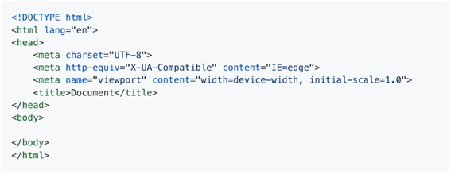
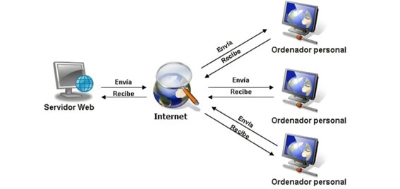

# __0373_A2_AlejandroLinares__

# _Evaluacion inicial_

### 1. Qué es una página web?
Es un documento de hipertexto que se visualiza en un navegador utilizando HTML, CSS y Javascript para diseñarlas.
### 2. ¿Qué es un servidor web?
Un servidor web es un dispositivo que almacena y procesa contenido de páginas web, gracias a él es posible que los usuarios puedan visitar un sitio web.
### 3. ¿Qué son los lenguajes de marcas? ¿Cuántos conoces?
Los lenguajes de marcas son sistemas de etiquetas de apertura y cierre, su propósito es que las personas puedan leer con facilidad el código de una página web por ejemplo, el código de estos lenguajes se centra en el contenido y su significado.

Tabla

|Nombre|Enlace a documentacion|
|--------|--------------------|
|HTML| [enlace](https://html.spec.whatwg.org/) |
|XML| [enlace](https://www.w3.org/XML/) |
|SMGL| [enlace](https://www.w3.org/TR/sgml-dtd/) |
|XHTML| [enlace](https://www.w3.org/TR/xhtml1/) |
|Markdown| [enlace](https://daringfireball.net/projects/markdown/) |

### 4. ¿Que es HTML? ¿Como se esctructura?
HTML es un lenguaje de marcas usado para estructurar y crear paginas web de forma legible para el usuario.

El codigo de la imagen corresponde a la estrucutura mas basica de programacion de una web en html, se ven diferentes apartos, como idioma, encabezado, cuerpo, titulos y disposiciones.

### 5. ¿Que es CSS?
CSS es la parte del codigo que esta orientada al diseño del sitio web. con CSS podemos controlar la fuente, el tamaño, la posicion y muchos otros aspectos relacionados al diseño.

### 6. ¿Sabes cómo funciona un navegador web? Describe brevemente el proceso que se sigue para visualizar una página web.
Si, un proceso de navegación web, no es nada más y nada menos que un usuario en la búsqueda de un sitio y web, y para llegar a él, inicia una serie de consultas desde su navegador hacia los diferentes servidores y directorios raíz para localizar dónde se encuentra alojada la petición del cliente y así poder acceder a la página web que el esta usuario está solicitando ver

De manera resumida el usuario que maneja el ordenador personal abre su navegador desde su escritorio y busca www.amazon.com desde google, primeramente la petición viaja desde el router del cliente hacia google, google pregunta al directorio raiz .com., este le responde con la Ip que corresponde al dominio y se redirige al usuario hacia ese servidor, hay mas consultas en el camino pero brevemente funciona asi.

